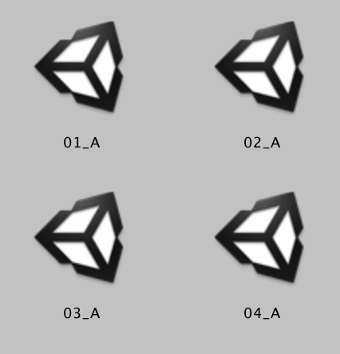

# HCTC-PARS
UI Redesign for HCTC Project

# Adding a Hazard to Training Scene
Adding a hazard can be done completely through the `Hazard_1` game object with contains the component `<TrainingHazardController>`
## 1. Create Hazard_1 Object
Copy the `Hazard_1` object from a previous Unity Training scene. Paste it inside the `Hazard_Data_Sprites` gameObject.
## 2. Setting Values in TrainingHazardController
```
public class TrainingHazard : Hazard {
	public string summaryText;
	public Color color;
        public string category;
	public string name;
```

Each of these values can be set in the Unity Properties panel. Select the `Hazard_1` object and scroll to the properties for `TrainingHazardController`. Set the values and save the scene.


## 3. Setting World Objects in Hazard_1 
The `Hazard_1` object looks like the following

The heirarchy is:
```
- Hazard_Data_Sprites
    - Hazard_1
        - Icon
        - Content
            - White ellipse (indicators, etc)
            - SummaryCanvas
```
### Icon

The icon changes based on whether its hazard was selected. This marks where the hazard is and is used to orient the user when they select the hazard.
- Move the icon in 3D space using the Unity SceneEditor screen
- It is set to always look at the camera.


### Content

All of the objects that you place under the `Content` gameObject will appear and disappear according to whether the specific hazard was selected. 
#### SummaryCanvas
"Hazard Text Here"
This panel is dynamically populated based on what you put in the `TrainingHazardController` gameObject. 
- Move the SummaryCanvas in 3D space using the Unity SceneEditor screen
- It is set to always look at the camera.

# Adding a New Scene
<!--  -->
The image above is how the PilotStudy Training folder looks. Each Training Scene is named to a special protocol, which the app depends on for iterating through all of the scenes of the correct type.

## Naming a Scene
The name breaks down into 2 parts:
`index`_`type`

`index` is the order the scene will appear in

`type` is the round type (A for Assessment, T for Training)

Note: Make sure that you do not skip an index for your scenes. This will cause an error during runtime.

## Adding a Scene


### Step 1: Save to a Training or Assessment folder
Make sure all your scenes of a certain type are in the same folder, for organizational purposes.

### Step 2: Add Scene to Build Settings
make sure you have your scene open during this step.

Go to File > Build Settings and Click Add Open Scenes. You should see your scene added to the `Scenes in Build` list.

### Step 3: Add the Scene to the PARSController
This step will be fixed in the future for a more elegant solution.

Go to the start screen of your scene type.
If your scene is an Assessment, go to `00_E_Start`.
If your scene is a Training, go to `00_T_Start`.

Find the controller object and in the properties panel change the Total Round Count + 1.
